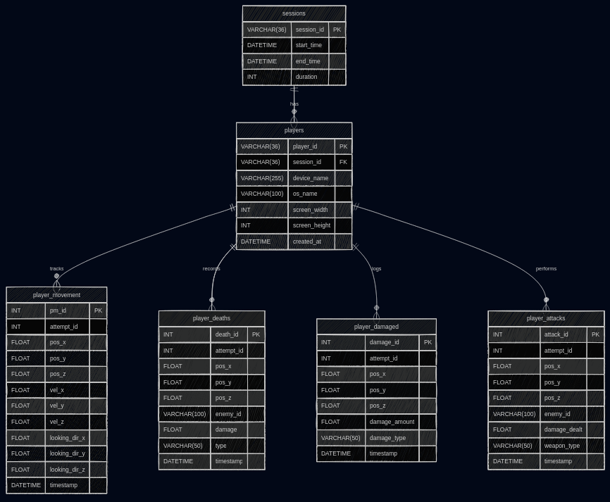

# Delivery 3: In-Editor Visualization - GDInsight

**Game Analytics & Telemetry System for Godot 4**

## Project Overview

GDInsight is a comprehensive data visualization toolkit built for Godot 4 that enables gameplay events to be collected, stored, and visualized directly in the editor. This system transforms raw telemetry data into meaningful spatial visualizations including volumetric heatmaps, movement paths, and event markers, providing game designers with actionable insights into player behavior.

**Engine:** Godot 4.5
**Project:** [3D Third-Person Controller](https://github.com/gdquest-demos/godot-4-3d-third-person-controller) by [GDQuest](https://github.com/gdquest-demos)
**Database:** MySQL with PHP backend

---

## 1. Visualization Strategy

### Data Collection Points

The system collects and visualizes the following gameplay data:

#### Spatial Data
- **Player Deaths**: Position, damage type, enemy responsible, timestamp
- **Player Movement**: Position, velocity, looking direction, timestamp (sampled)
- **Enemy Deaths**: Position, damage dealt, weapon used, timestamp
- **Damage Events**: Position where player took damage

#### Session Data
- **Attempt Tracking**: Each death creates a new attempt ID
- **Session Management**: Automatic session creation and tracking

### Visualization Types

1. **Volumetric Heatmap**
   - Uses Godot's `FogVolume` with 3D texture density maps
   - Shows aggregate death positions across ALL attempts
   - Dynamic bounds calculation based on data

2. **Movement Paths**
   - Color-coded by velocity (blue → red spectrum)
   - Continuous curve visualization using `ImmediateMesh`
   - Shows player movement for specific attempts
   - Temporal information preserved

3. **Event Markers (Waypoints)**
   - **Player Deaths**: Red spheres with cross icons
   - **Coin Pickups**: Yellow spheres with coin icons
   - **Enemy Deaths**: Green 3d models of the enemy
   - 3D billboarded icons always facing camera
   - Attempt-specific markers

---

## 2. Import/Export Pipeline

### Architecture

```
Game Runtime → PHP Backend → MySQL Database → Godot Editor
```

---

## 3. Editor Visualizations

### Custom Editor Dock

**Location:** Bottom panel → GDInsight tab

**Features:**
- Category toggles (Waypoints, Player Path, Heatmap, Player Replay)
- Attempt selection via SpinBox
- Real-time data fetching
- Visualization clearing controls
- Status feedback

## 4. Database Schema

### Entity Relationship Diagram



### Table Details

#### `sessions`
Tracks gameplay sessions from start to end.

#### `players`
Stores player device information and links to sessions.

#### `player_movement`
Records player position, velocity, and looking direction over time. Used for path visualization.

#### `player_deaths`
Logs death events with position, enemy responsible, and damage details. Used for heatmap and waypoint generation.

#### `player_damaged`
Tracks damage events that didn't result in death.

#### `player_attacks`
Records player combat actions against enemies.

---

## 5. PHP Scripts

### Backend API Endpoints

**Base URL:** `https://citmalumnes.upc.es/~hugopm/`

- [connect_db](addons/GDInsight/php/connect_db.php)
- [end_session](addons/GDInsight/php/end_session.php)
- [get_insight_data](addons/GDInsight/php/get_insight_data.php)
- [hello_world](addons/GDInsight/php/hello_world.php)
- [new_attempt](addons/GDInsight/php/new_attempt.php)
- [new_player](addons/GDInsight/php/new_player.php)
- [player_attacked](addons/GDInsight/php/player_attacked.php)
- [player_damaged](addons/GDInsight/php/player_damaged.php)
- [player_died](addons/GDInsight/php/player_died.php)
- [player_moved](addons/GDInsight/php/player_moved.php)
- [start_session](addons/GDInsight/php/start_session.php)

---

## 6. Usage Guide

### Basic Workflow

1. **Play Game Session:**
   - Run game (F5)
   - Data automatically collected
   - Each death increments attempt ID

2. **Open Editor Visualization:**
   - Stop game
   - Open the [main](main.tscn) scene in editor
   - Open GDInsight dock panel

3. **Load Data:**
   - Select attempt ID
   - Check desired categories
   - Click "Get Data"

4. **Inspect Visualizations:**
   - Heatmap: Gets all the death from the players and creates a volumetric heatmap
   - Waypoints: Event-specific markers (deaths and enemy kills)
   - Path: Movement trajectory
   - Replay: Timeline of player movement through the path

5. **Clean Up:**
   - Click "Clear All" to remove visualizations
   - Load different attempt for comparison

---

## 7. Credits & License

**Developed by:** @mdoradom @hugoplanell @martagnarta
**Course:** Data Analytics - CITM 2025-2026
**Engine:** Godot 4.5
**License:** MIT

**Dependencies:**
- Godot Engine (MIT License)
- PHP 7.4+ (PHP License)
- MySQL Community Edition (GPL)
- GDQuest 3D Third-Person Controller Demo (MIT License)
